# 로컬 단일 이미지 입력

## 2026-09-13 실제 실행 판정

검증 제품 commit은 `7e557635f9ff1f1f169cc5cde6f121835d09d71a`, production build ID는 `u-QOCE60QJ97VipDOJB24`다. `LOCAL_IMAGE_FLOW_VERIFIED`와 `PLAYBACK_BASELINE_PRESERVED`를 충족했다. 실제 사용자 JPEG는 새 인식·근거 연결·초안 보존까지 통과했지만 미지원 표기·시간축·원본 연결 불확실성으로 `USER_JPEG_BLOCKED`다. 이미지 입력 기능 구현·검증 완료와 사용자 JPEG의 실용적 전곡 목표 미완료를 구분한다.

최종 타입·전체 lint·기본1,025개·opt-in private5개·production build를 실행해 통과했다. 기본 실행에서 건너뛴 private5개를 별도로 실행했고 반복 실행을 고유 개수에 더하지 않았다. 실제 Windows 취소/owner 종료/사전취소/mutex, 실제 HTTP 소유권·CSRF·손상 입력, production Chrome/Edge의 저장·다운로드·재입력·재생을 확인했다. 응답 유실·retry 복구의 오류 주입 시험은 실제 A 주 경로와 구분했다. 기존 원격 OMR/DB 경로는 미변경이어서 PostgreSQL·원격 통합을 재실행하지 않았다.

두 fresh 인식은 e933aac 위 정확한 미커밋 runner 파일 hash를 기록하며 수행했고 최종 commit에 보존됐다. 이후 손상 이미지의 오류 분류와 UI 응답 복구를 수정한 최종 build에서 회귀·일반 경로를 확인했다. 새 인식을 반복하지 않고 동일 결과의 UI/저장을 검증했으며, 과거 실행의 HEAD를 새 commit으로 바꾸지 않았다. 원본·실행 자료·파일별 hash는 저장소 밖 `HarmonyMaker-local-image-v1` 인계에 보존했다.

첫 A 실행은 실제 메모리 압력으로 안전 중단됐다. 명시적인 재시도 때 전용 시험 브라우저를 닫아 여유를 확보하고 동일 프로필로 재개했다. 이 제약과 최초 UI 전달 시간 미측정, 사람의 교정/청감 미측정을 상세 인계에 남긴다. 이번 변경으로 사진 인식 전체 완성·모든 악보 지원·외부 배포를 주장하지 않는다.

`/local-image`는 설치된 Windows homr 환경을 기존 후보·작업 공간 경계에 연결한다. 원본 선택 → 새 로컬 인식 → 보완 → 원본·후보·근거 검증 → IndexedDB 초안 저장 → 교정 화면으로 이어진다. 과거 인식 결과를 새 실행으로 대체하지 않는다.

```mermaid
flowchart LR
  UI[PNG/JPEG 미리보기·권리] --> API[loopback API · 세션/Origin/CSRF]
  API --> JOB[불변 입력·요청 + 원자적 상태]
  JOB --> WORKER[단일 worker · Windows mutex]
  WORKER --> RUN[Windows Job · 고정 Python/homr]
  RUN --> SUP[기존 OCR·박자·코드·슬래시 보완]
  SUP --> BUNDLE[기존 후보 묶음 + 실행/모델 hash]
  BUNDLE --> CHECK[묶음 검증·작업/입력 대응]
  CHECK --> DRAFT[IndexedDB 영속 초안]
  DRAFT --> REVIEW[일반 UI 교정·대조]
  REVIEW --> SOURCE[기존 Source 검증]
```

## 실행 계약

- Node 22, 기존 lockfile/설치 의존성, Windows Python 환경을 재사용한다. 새 패키지·모델 설치는 없다.
- `HM_LOCAL_IMAGE_BUILD=1`의 production build/start는 `.next-local-image`를 사용한다. 기존 `.next`와 사용자 서버를 보존하는 로컬 선택 설정이다. `HM_LOCAL_NO_DISK_CACHE`는 이 production 실행에 사용하지 않는다.
- `HM_LOCAL_IMAGE_OMR=1`, `HM_LOCAL_IMAGE_ORIGIN=http://127.0.0.1:<port>`, 절대 경로 `HM_LOCAL_IMAGE_ROOT`, `HM_LOCAL_IMAGE_COMPARE`가 필요하다. 서버는 `--hostname 127.0.0.1`로 실행한다. 기본 앱에서는 로컬 인식이 비활성이다.
- compare 경로의 homr HEAD `457e7c6518a10ba755db2e60883419e56c4d7369`, 6개 ONNX 모델과 eng/kor traineddata를 검사한다. 모델 재사용과 이미지 결과 캐시 재사용은 다르다.
- 12 MiB/2천만 픽셀 이하 단일 PNG/JPEG만 받는다. EXIF 자동 회전·다중 페이지·PDF는 새 경로에서 거절한다.
- 600초, 프로세스당 commit 2048 MiB, CPU 2개 affinity 및 실제 호스트 메모리·디스크 압력을 관찰한다. Windows 관측을 다른 운영체제의 자원 요구량으로 일반화하지 않는다.

## 상태·소유권

입력 바이트와 작업 UUID를 먼저 저장한다. 동일 UUID의 다른 입력/설정은 거절한다. HTTP는 인식 종료를 기다리지 않고 작업을 반환한다. Windows named mutex와 활성 작업 기록으로 무거운 실행을 한 건으로 제한한다. worker는 고정 실행 파일과 경로만 사용한다.

HttpOnly/SameSite 쿠키와 CSRF, 정확한 Host/Origin 검사를 사용한다. 작업·원본·결과·취소·재시도 모두 소유권을 검사한다. 다른 브라우저의 작업은 노출하지 않는다. 원본·인증값·전체 proof를 공개 로그나 원격 공유로 보내지 않는다. Python의 네트워크 호출 방어는 앱 실행 경로의 보호이며 OS 전체 방화벽 보장은 아니다.

응답 유실 시 같은 작업을 조회한다. 이미 후보가 준비됐으면 저장을 완료하고 교정 화면을 연다. 불확실한 503은 미접수의 증거가 아니므로 같은 ID를 보존한다. 명시적인 접수 전 거절에만 새 입력을 허용한다. 새로고침은 인식을 새로 시작하지 않는다. 일반 완료 이력은 사용자가 열 때 연결한다.

worker는 서버 재시작과 독립적으로 실행된다. 중단된 worker/observer를 확인하면 interrupted로 남기고 자동 재인식하지 않는다. 취소는 해당 작업의 cancel 파일과 kill-on-close Windows Job으로 자식 트리만 종료한다. 자식은 suspended 상태에서 Job에 배정한 뒤 실행하며, 이미 취소됐으면 명령을 실행하지 않는다. 원본과 부분 출력은 남긴다.

## 음악 경계와 검증 해석

`candidate-ready`는 교정이 필요한 후보 준비 상태다. 기존 후보 bundle, XML, 좌표·근거, 입력/결과 hash 및 실행 metadata를 검사한다. 안정적인 `image:<job UUID>` 초안 ID와 기존 IndexedDB CAS로 다른 탭에서 교정한 revision을 덮어쓰지 않는다. Source 확정은 기존 snapshot·요청의 검증 결과로만 가능하다.

Source/WAG 음악 규칙, 조성/시간축 조건, playback/mixer는 변경하지 않았다. 기존 Lead 0.028, 화음당 0.032, Band 음당 0.006, attack 3ms/release 8ms를 유지한다.

검증은 공개 단위·오류 주입, 실제 Windows 프로세스 제어, 실제 새 homr 인식, production 브라우저 UI로 분리한다. 실제 A PNG는 새 결과를 원본과 대조하여 마지막 Dm 추가와 잘못된 페르마타 제거 후 기존 Source 이후 경로를 사용했다. JPEG는 저장·복구해도 미지원 구조·시간축 불확실성이 남으면 계속 차단한다. A 통과를 JPEG 전곡 실용성으로 일반화하지 않는다.

원본·전체 로그·작업 공간·프로젝트·MusicXML은 저장소 밖 비공개 인계에 둔다. 작업별 execution의 HEAD와 정확한 runner 파일 hash를 보존한다. 최종 제품 commit, 이후 문서 commit, 최초 실제 인식 당시 미커밋 runner hash를 구분한다. 상세 결과·검증 주소·환경 경로는 해당 로컬 인계의 시작 안내와 manifest를 따른다.
