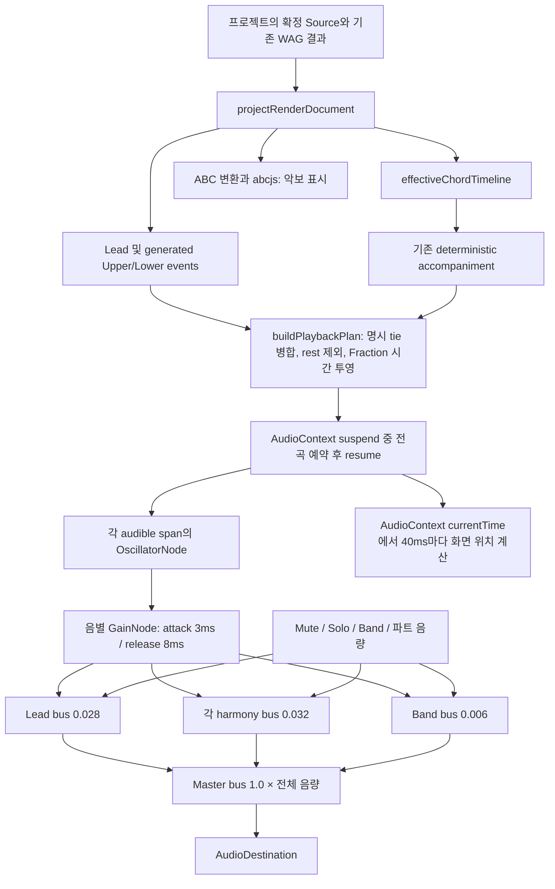

# 재생 오디오와 기본 믹스 검증 — 2026-09-13

기술 판정: **PLAYBACK_READY**. 수정 후 사람 청감 재평가: **HUMAN_RECHECK_NOT_RUN**.

사용자의 첫 실제 청취 결과는 “Band OFF의 생성 화음은 대체로 자연스럽다”, “Band ON에서는 화음이 묻힌다”였다. 이후 깨짐·끊김 표현을 “한 음 한 음 날 때마다 잡음과 함께 나는 느낌”으로 구체화했다. 이 기록은 사람의 실제 관찰이며, 아래 자동 측정이 수정 후 청감 만족을 대신하지 않는다. 당시 속도는 확인되지 않아 100%를 기본 재현 조건으로 삼고 75%, 150%를 추가했다.

## 검증 대상과 변경 경계

- 브랜치: `codex/harmonymaker-source-boundary-v1`.
- 시작 HEAD: `44742150c0b2464f8d101e83f6268454c1241b17`, 시작 작업 트리 clean.
- 검증 제품 commit: `8fb9a5092a85643998bc6f607e24cfb26c52b300`.
- production build ID: `-_83F5zXnvwJ1UN2_F4Jt`, Next 16.3.0 / Node 22.23.2.
- 실행: `node node_modules/next/dist/bin/next start --hostname 127.0.0.1 --port 3196`.
- 입력: 기존 로컬 시험판의 최종 A project JSON. Source 30음표, 생성 Lower / H1 표기 30음표, 명시 tie continuation 14개. 재생 plan은 Lead 30 + 병합된 harmony 16 + Band 32 = 78개 event.
- 이번 제품 변경은 `practice-audio.ts`, `practice-audio-ownership.ts`, `ProductPracticePlayer.tsx`, 최소 volume CSS, 관련 unit test에 한정한다. Source, WAG, accompaniment의 음악 규칙, playback-plan, 프로젝트 형식은 변경하지 않았다.

이 문서 이후 문서 전용 commit은 검증 제품 commit과 구분한다. 새 패키지 설치, 환경 검사 완화, 캐시/프로필 삭제, 사용자 프로세스 종료, 외부 배포는 수행하지 않았다. 시작 시 실제 여유 RAM 약 0.37GiB, C: 약 3.69GiB였으므로 무거운 회귀와 브라우저를 순차 실행했다.

## 실제 재생 경로

Lead와 각 생성 성부는 sine, Band는 triangle oscillator다. AudioBufferSource·샘플 로딩·별도 Band clock은 없다. 기존에는 oscillator마다 고정 gain 하나를 거쳐 destination에 직접 연결했으며 master/track bus와 음별 envelope가 없었다. `abcjs`는 이 경로에서 악보 표시만 담당한다.

재생 속도는 `quarterSeconds = (60 / bpm) / ((4 / beatUnit) × dotted 계수) × (100 / speed)`로 시간만 바꾼다. 주파수는 그대로다. A의 점4분음표=60은 quarter BPM 90이며 전곡 길이는 100% 16초, 75% 21.333초, 150% 10.667초다. 시작 준비 여유 50ms는 전곡 길이에 포함하지 않는다.

전곡을 한 번에 예약하는 기존 구조를 유지했다. 새 구현은 context를 suspend하고 모든 node의 start/stop을 audio clock에 예약한 뒤 resume한다. 50ms look-ahead를 반복 보충하는 scheduler가 아니다. 초기 horizon은 전곡 길이이며 `setInterval(40)`은 커서 표시용이다. 주기 지연은 화면 반영을 늦출 수 있지만 음악의 시작 시각을 결정하지 않는다.

A에서는 78개 oscillator와 78개 envelope가 미리 만들어지며, 동시에 start~stop 범위 안인 oscillator는 최대 6개다. Band의 동일 onset 4음과 보컬 2음이 겹칠 수 있다. muted 성부도 예약하고 bus를 0으로 두어 재생 중 다시 켤 수 있다. 끝난 node/envelope는 disconnect되고 소유 목록에서 제거된다. 이는 A 규모에서 측정한 결과이며 임의 대규모 악보의 부하 검증은 아니다.

명시 tie는 기존 playback-plan에서 같은 pitch와 인접 범위를 확인해 하나의 oscillator로 병합한다. tie continuation에는 새 attack을 넣지 않는다. 일반 rest, 반복 음의 재발음, slur의 의미는 변경하지 않았다.

Mute/Solo/Band와 음량은 bus를 8ms ramp로 바꾼다. Solo가 선택되면 기존 정책대로 그 성부만 들리며, Solo 해제 후 Mute/Band 상태를 다시 적용한다. 음량 100%는 아래 기본 gain의 배수 1이며 모든 성부의 절대 gain이 같다는 뜻이 아니다. Lead 및 각 harmony/Band는 0~200%, Master는 0~100%다. 음량은 현재 플레이어 세션에만 보관하며 프로젝트 JSON에 추가하지 않는다.

Pause는 audio clock의 위치를 보관하고 master를 8ms 동안 낮춘 뒤 이전 context를 닫는다. Resume은 새 context에서 남은 event 범위만 예약한다. Reset·속도 변경·프로젝트 교체·unmount도 소유 context를 해제한다. 속도 변경은 처음으로 돌아가며 기존 예약과 겹치지 않는다. 해제용 28ms timer는 무음이 된 graph를 정리하기 위한 것이고 note timing 권위가 아니다. 준비 중 취소된 async resume 완료는 현재 세션이 아니면 폐기한다.

## MIX_BALANCE

기존 Band gain 0.018은 합쳐진 반주 전체가 아니라 각 반주 음에 적용됐다. A의 네 반주 음과 triangle의 배음이 동시에 더해져, 반주 합산 RMS가 단일 harmony보다 조금 컸다. 이 상대 레벨은 사용자가 보고한 마스킹과 일치하는 객관 근거다. 실제 청감상 마스킹의 정도는 RMS만으로 확정하지 않는다.

| 출력 | 기존 gain | 새 기본 gain | 100% RMS 기존 → 수정 | 100% peak 기존 → 수정 |
|---|---:|---:|---:|---:|
| Lead | 0.028 | 0.028 | 0.01980 → 0.01966 | 0.02800 → 0.02800 |
| 각 generated harmony | 0.028 | 0.032 | 0.01980 → 0.02254 | 0.02800 → 0.03200 |
| Lead + harmony | 각 성부 합 | 각 bus 합 | 0.02801 → 0.02990 | 0.05600 → 0.06000 |
| Band 전체 | 음마다 0.018 | bus 0.006 | 0.02079 → 0.00691 | 0.06171 → 0.02057 |
| 전체 출력 | 직접 합산 | master 1.0 | 0.03440 → 0.03049 | 0.10619 → 0.07641 |

위 값은 44.1kHz OfflineAudioContext, A 전곡, 정규화하지 않은 float PCM의 진폭이다. 기존 renderer를 그대로 재현한 기준과 실제 새 renderer 모듈을 같은 plan에 적용했다. Band RMS는 약 -9.56dB, harmony는 +1.13dB, 전체는 약 -1.05dB다. Master를 키워 해결하지 않았다. Lead의 약 -0.06dB 차이는 짧은 envelope 때문이다.

새 75/100/150%의 모든 기본 mix와 모든 파트 200% / master 100% 조건에서 clipping sample과 NaN/Infinity는 0이었다. 검사 중 최대 peak는 0.15438이었다. 이는 검증 A의 결과이며 모든 입력·음향 장치의 무왜곡 보장이 아니다. peak/RMS는 상대 레벨 검사이며 LUFS나 사람의 loudness 평가가 아니다.

## AUDIO_GLITCH

**음표 경계의 급격한 파형 점프는 재현했다. 긴 dropout은 일반 재생에서 재현하지 못했다.** 기존 코드는 note 종료까지 gain을 유지하다 `oscillator.stop(end)`로 즉시 잘랐다. sine의 시작 위상이 0이어도 종료 시점의 값은 0이 아닐 수 있어 각 재발음에 광대역 click을 만들 수 있었다. triangle 반주가 겹치면 불연속도 더해졌다.

100% 전체 출력에서 가장 큰 경계 점프는 음악 시작 12초, quarter 18, 7마디 시작이었다. A→Dm 코드 경계에 6개 source가 끝나고 6개가 시작했다. 측정 context 시각은 시작 여유를 포함한 12.05초다. 해당 시점은 정상적인 코드/음표 교체이며 rest나 tie continuation이 아니다. 150%의 가장 큰 경계는 quarter 9, 음악 4초의 동시 재발음이었다. 실제 사람이 지적한 정확한 시점은 미제공이므로 이 시각을 사용자 청취 시각이라고 단정하지 않는다.

| 100% PCM의 음악 경계에서 인접 sample 차이 최댓값 | 기존 | 수정 |
|---|---:|---:|
| Lead 단독: gain 동일, envelope 효과 분리 | 0.027904 | 0.000103 |
| harmony 단독 | 0.027782 | 0.000092 |
| Lead + harmony | 0.051364 | 0.001359 |
| Band 단독 | 0.021640 | 0.000020 |
| 전체 | 0.053753 | 0.001450 |

전체 경계의 약 31dB 감소와 gain이 같은 Lead의 감소가 envelope 수정의 근거다. 연속 파형도 sample 간 자연스러운 차이가 있으므로 이 수치를 모든 잡음의 크기나 청감 점수로 부르지 않는다. 새 attack 3ms/release 8ms는 원래 note start/end 안에 들어가며 짧은 note에서는 각각 길이의 1/4 이하로 제한된다.

기존과 수정 버전의 실제 production Chrome에서 Lead only / Lead+Harmony / Band only / 전체를 100%로, 전체를 75/150%로 끝까지 재생했다. 새 버전은 Edge에서도 같은 6개 전체 재생을 했다. passive AudioWorklet tap은 앱 destination으로 가는 출력에 측정 가지를 추가했으며 Source·완료 상태·plan을 주입하지 않았다. 블록 시각, sample peak/RMS, 잘못된 수치, source 생성/예약/종료, gain, context 상태와 currentTime, output timestamp, main-thread long task를 기록했다.

- 일반 재생: 늦게 예약된 event 0, clipping 0, NaN/Infinity 0, 예기치 않은 30ms 이상 near-zero 구간 0, 관측 블록의 30ms 이상 누락 0. 재생 구간의 50ms 이상 long task는 관측되지 않았다. import/setup 중 long task는 재생 구간과 분리했다.
- 새 Chrome/Edge: 모든 full plan의 최소 예약 여유 50ms, 최대 active oscillator 6, 최대 동시 start 6, BufferSource 0. startup clock을 먼저 고정하는 수정은 지연 상황의 보강이며 기존 일반 재생에서 첫 음 누락이 실제 발생했다고 주장하지 않는다.
- 별도 오류 주입: resume 250ms 지연 + 실제 main-thread timer task 350ms 정지. Chrome/Edge에서 long task가 관측되고도 이미 예약된 전체 출력에 late event·30ms gap·clipping이 없었다. 이는 일반 사용자 흐름에 합산하지 않았다.
- 각 브라우저에서 12개 live mixer 조작은 context 재시작 없이 적용됐다. Pause/Resume/Reset/속도 변경 시험의 10개 context는 각각 한 번씩 닫혔다. Resume 위치 Chrome quarter 2.117, Edge 2.101에서 남은 73개 event의 pitch/start/end를 원 plan과 대조했고 중복·누락이 없었다.
- 실제 OfflineAudioContext는 각 속도의 Lead/harmony/voices/Band/full/full-max 18조건을 검사했다. harmony의 14개 tie continuation은 계속 같은 enclosing sound 안에 있고 주변 PCM이 이어졌다. 일반 event의 start/end·frequency도 실제 browser AudioParam의 float32 값과 대조했다.
- 계측 없이 일반 UI로 가져와 Band ON·100%로 전곡을 재생한 콘솔 보충 시험도 Chrome/Edge에서 통과했다. 각 브라우저의 console error·page error·실패한 앱 요청은 0이었다. 각 1개의 CSS preload 사용 시점 warning은 그대로 기록했으며 오디오 결함으로 분류하지 않았다.

측정 가지와 offline render는 OS 드라이버·스피커·헤드폰 뒤의 실제 출력을 녹음하지 않는다. 하드웨어 underrun과 사용자의 잔여 잡음은 재청취로 확인해야 한다. 긴 dropout이 관측되지 않았다는 결과를 모든 환경에서의 부재로 일반화하지 않는다.

초기 검증 도구 오류도 보존했다. 구버전 Chrome의 6개 일반 UI 재생 뒤 offline 함수 호출 누락으로 harness가 종료됐으며, 해당 offline 부분만 보완 실행했다. 첫 새 Chrome 검증의 float64/AudioParam float32 비교와 CDP evaluate busy loop의 LongTask 미관측은 도구 조건 문제였다. float32 기준으로 다시 대조하고 실제 timer task로 추가 검증했다. 이 오류를 제품 실패로 세거나 기존 실패 파일을 지우지 않았다.

## MUSIC_CONTENT

실제 UI로 프로젝트를 새 사본으로 열고 시험 후 다시 내보냈다. Chrome/Edge 다운로드는 원본 프로젝트 전체와 canonical 내용이 같고 파일 SHA-256도 `4838ca5b7bf32676772a04a414f4b0b9112d239814e72bdd7c632e822c6a825e`로 동일했다. Source, WAG variants, ArrangementRenderDocument, playback plan도 전후 각각 동일했다. pitch/onset/duration/chord/tie와 Source proof는 변경하지 않았다.

기존 trial-ready artifact manifest의 실제 41개 파일도 모두 동일했다. 실제 A 음악·원본·private proof·상세 event 로그는 로컬 outputs/work에만 남기고 저장소에 넣지 않았다.

## VALIDATION

| 검사 | 이번 결과 |
|---|---|
| 코드 경로 검수 | PASS, 범위를 제한한 직접 코드·측정 검수. 외부 독립 감사 아님 |
| typecheck | PASS, `tsc --noEmit`, 종료 0 |
| 전체 lint | PASS, `eslint .`, 종료 0 |
| 관련 unit | 4파일 25개 PASS; 이 중 새 renderer 6개. 전체 수에 중복 합산하지 않음 |
| 전체 기본 회귀 | 105파일 998개 PASS, 3파일 5개 opt-in skipped |
| production build | PASS, 기본 `next build`, 종료 0, 17개 정적 페이지 |
| production Chrome | PASS, 152.0.7977.83, 실제 UI 6개 전곡 + 12개 mixer 조작 + transport + 다운로드 |
| production Edge | PASS, 153.0.4234.32, Chrome과 같은 흐름 |
| PCM / timing / tie / 주입 지연 | PASS, 일반 재생과 주입 시험의 증거 별도 보존 |
| 프로젝트 음악·내용 보존 | PASS, 실제 UI 다운로드와 원본 동일 |
| PostgreSQL / OMR 재실행 | NOT_RUN, DB·서버·인식 경로가 바뀌지 않은 오디오 범위이므로 반복하지 않음 |
| 수정 후 사람 청감 | NOT_RUN, 자동으로 PASS하지 않음 |

기본 회귀에서 건너뛴 opt-in은 `experiments/homr-integration/app-import.test.ts` 1개, `boundary-private.test.ts` 3개, `review-handoff.test.ts` 1개다. 인식 후보·Source 경계가 바뀌지 않아 이번에 후속 실행하지 않았다. 그 과거 PASS를 이번 회귀 수에 가져오지 않았다. 이번 private A 자료의 오디오/프로젝트 대조는 별도 실제 브라우저·offline 검증이다.

type/lint/기본 test는 제품 변경을 stage한 상태에서 실행해 로그 HEAD가 시작 commit이다. 세 실행과 최종 commit build의 코드 트리 SHA-256은 모두 `1385c2c445a955a998b9e069b11d9bba03ae2c26f1a5c582c8a18ddf5fe62601`로 같아 동일 제품 코드에 대응한다. 문서 SHA를 맞추기 위한 build 반복은 하지 않는다.

## HUMAN_RECHECK

같은 Chrome과 음향 장치에서 A 프로젝트를 열고 모든 슬라이더 100%, Speed 100%로 시작한다. 생성 Lower / H1은 Band OFF에서 들은 뒤 Band ON에서도 선율을 식별할 수 있는지 확인한다. 다음으로 음이 바뀔 때마다 나던 잡음, 특히 음악 4·8·12초 근처를 듣는다. Lead와 Lower Solo로 원인을 나누고 Pause/Resume 및 음량 이동에서 새 click이 없는지도 확인한다.

재발하면 시점, Band 상태, Solo/Mute, 속도, 브라우저, 스피커/헤드폰을 기록한다. 자연스러움·가창 적합성·실제 장치 음질과 물리 iPhone은 자동 PCM 검증으로 평가하지 않는다. 이번 수정 후 사람 피드백을 아직 받지 않았다.

OMR 인식 정확도, JPEG/C 자동 복원, 3/4·tuplet·임의 다성부 지원 범위는 그대로다. 외부 공유 생성·push·배포·main merge는 수행하지 않았다. 과거 Playwright persistent profile 종료 문제는 이번에 수정한 대상이 아니며, 이번 시험은 설치된 Chrome/Edge 직접 기동과 새 전용 프로필/CDP를 사용했다.
